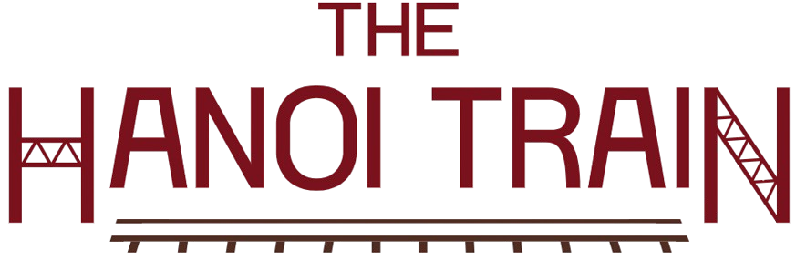

<html lang="vi">
<head>
<meta charset="UTF-8">
<meta name="viewport" content="width=device-width, initial-scale=1.0">
<title>Tàu Hà Nội 5 Cửa Ô — Chuyến tàu du lịch văn hóa đầu tiên của Hà Nội | Đặt vé</title>
<meta name="description" content="The Hanoi Train — Tàu Hà Nội 5 Cửa Ô: gần 4 tiếng trải nghiệm văn hóa, toa tàu 2 tầng, hát chèo hát xẩm, Đền Đô, cầu Long Biên. Đặt vé ngay.">
<link rel="icon" type="image/png" href="logo.png">
<link rel="preconnect" href="https://fonts.googleapis.com">
<link rel="preconnect" href="https://fonts.gstatic.com" crossorigin>
<link href="https://fonts.googleapis.com/css2?family=Playfair+Display:ital,wght@0,400..900;1,400..900&display=swap" rel="stylesheet">

<!-- ═══════ TRACKING — BẬT TẠI ĐÂY (GA4 / Meta Pixel / TikTok Pixel / Clarity / GSC) ═══════

<meta name="google-site-verification" content="MA_XAC_THUC">
══════════════════════════════════════════════════════════════════════════════════════════ -->

</head>
<body>

<!-- ══════════ HEADER ══════════ -->
<header id="header">
  

    <!-- ▶ LOGO: lưu ảnh logo "THE HANOI TRAIN" thành logo.png cùng thư mục index.html -->
    <a class="logo" href="#hero" aria-label="The Hanoi Train — Tàu Hà Nội 5 Cửa Ô">
      
      5
      <b>THE HANOI TRAIN</b><small>5 CỬA Ô · EST. 2024</small>
    </a>
    <nav id="nav" aria-label="Điều hướng chính">
      <a href="#hanh-trinh">Hành trình</a>
      <a href="#toa">Các toa tàu</a>
      <a href="#gia-ve">Giá vé</a>
      <a href="#lich">Lịch chạy</a>
    </nav>
    

      <a class="btn btn-green sm js-book" href="https://booking.5cuaohanoi.vn/?ref=web" target="_blank" rel="noopener">🟢 Đặt vé ngay</a>
      <button id="burger" aria-label="Mở menu"></button>
    

  

</header>

  

    <a class="logo" href="#hero">5<b>THE HANOI TRAIN</b><small>5 CỬA Ô</small></a>
    <button id="mclose" aria-label="Đóng menu">✕</button>
  

  <nav>
    <a href="#hanh-trinh">Hành trình<small>01</small></a>
    <a href="#toa">Các toa tàu<small>02</small></a>
    <a href="#gia-ve">Giá vé<small>03</small></a>
    <a href="#lich">Lịch chạy<small>04</small></a>
  </nav>
  <a class="btn btn-green js-book" href="https://booking.5cuaohanoi.vn/?ref=web" target="_blank" rel="noopener">🟢 Đặt vé ngay</a>

<!-- ══════════ HERO (ảnh động) ══════════ -->
<section id="hero">
  

    

    

    

    

    

  

  

  

    
CHUYẾN TÀU DU LỊCH VĂN HÓA ĐẦU TIÊN CỦA HÀ NỘI

    <h1>
      Khám phá Hà Nội
      theo cách bạn
      <em>chưa từng trải nghiệm</em>
    </h1>
    

      <a class="btn btn-green js-book" href="https://booking.5cuaohanoi.vn/?ref=web" target="_blank" rel="noopener">🟢 Đặt vé ngay</a>
      <a class="btn btn-ghost" href="#video-tour">Xem video hành trình ↓</a>
    

    

      🕰 <b>Gần 4 tiếng</b> trải nghiệm
      🚃 <b>Toa tàu 2 tầng</b> độc đáo gợi lại ký ức Hà Nội xưa
      🎶 Thưởng thức <b>âm nhạc nghệ thuật truyền thống</b> Việt Nam
    

    

      
Chuyến tiếp theo

      

        <b class="b-shift">08:00 – 11:30 · Ca sáng</b>
        —
        <small>Còn lại</small><b id="cdSang">--:--:--</b>
      

      

        <b class="b-shift">13:30 – 17:00 · Ca chiều</b>
        —
        <small>Còn lại</small><b id="cdChieu">--:--:--</b>
      

    

  

  CUỘN ĐỂ KHÁM PHÁ ↓
</section>

<!-- ══════════ SECTION VIDEO RIÊNG + TICKER ══════════ -->
<section id="video-tour" class="video-sec">
  

    <!-- ▶ VIDEO: ưu tiên file tau-ha-noi.mp4 đặt cạnh index.html; nếu chưa có sẽ thử link Drive.
         Nếu Drive chặn phát → hiện poster + nút mở video -->
    <video id="tripVideo" autoplay muted loop playsinline controls preload="auto">
      <source src="tau-ha-noi.mp4" type="video/mp4">
      <source src="https://drive.usercontent.google.com/download?id=1_RVSQkgJK4xlLJ5VMsWZr2iFJrrNt9TR&export=download&confirm=t" type="video/mp4">
    </video>
  

  <!-- Ticker: mỗi mục 1 icon riêng biệt -->
  

    

      

        🚉 GA HÀ NỘI🕰 GẦN 4 TIẾNG TRẢI NGHIỆM🎭 HÁT CHÈO🎻 HÁT XẨM🚂 GA TỪ SƠN🏯 ĐỀN ĐÔ🌉 CẦU LONG BIÊN🎶 QUAN HỌ BẮC NINH
      

    

  

</section>

<!-- ══════════ SOCIAL PROOF ══════════ -->
<section id="proof" class="sec">
  

    <h2 class="h2 center" data-rv>Hàng chục nghìn du khách và doanh nghiệp lớn <em>đã trải nghiệm</em></h2>
  

  

    

      <a class="press-logo" style="--bc:#1B6CA8" href="https://vtv.vn" target="_blank" rel="noopener">VTV</a>
      <a class="press-logo" style="--bc:#A8231F" href="https://vnexpress.net" target="_blank" rel="noopener">VnExpress</a>
      <a class="press-logo" style="--bc:#D93824" href="https://tuoitre.vn" target="_blank" rel="noopener">Tuổi Trẻ</a>
      <a class="press-logo" style="--bc:#184A8E" href="https://thanhnien.vn" target="_blank" rel="noopener">Thanh Niên</a>
      <a class="press-logo" style="--bc:#C2331D" href="https://dantri.com.vn" target="_blank" rel="noopener">Dân Trí</a>
      <a class="press-logo" style="--bc:#B22222" href="https://hanoimoi.vn" target="_blank" rel="noopener">Hà Nội Mới</a>
      <a class="press-logo" style="--bc:#E31E24" href="https://vietnamnet.vn" target="_blank" rel="noopener">VietnamNet</a>
      <a class="press-logo" style="--bc:#D6232F" href="https://tienphong.vn" target="_blank" rel="noopener">Tiền Phong</a>
    

  

  
Chạm vào logo để mở trang báo chính thức.

  

    

      <article class="plat-card">
♪
<b>TikTok</b>
2,4 triệu+

Lượt xem các video trải nghiệm chuyến tàu.
<a href="#" target="_blank" rel="noopener">Xem kênh →</a></article>
      <article class="plat-card">
◉
<b>Instagram</b>
18.000+

Bài check-in với hashtag #5CuaO.
<a href="#" target="_blank" rel="noopener">Xem hashtag →</a></article>
      <article class="plat-card">
▶
<b>YouTube</b>
300+

Vlog review chi tiết từ travel blogger.
<a href="#" target="_blank" rel="noopener">Xem video →</a></article>
      <article class="plat-card">
f
<b>Facebook</b>
50.000+

Người theo dõi fanpage chính thức.
<a href="#" target="_blank" rel="noopener">Theo dõi →</a></article>
    

  

</section>

<!-- ══════════ 6 LÝ DO ══════════ -->
<section id="vi-sao" class="sec">
  

    
01 · Trải nghiệm độc quyền

    <h2 class="h2" data-rv>Vì sao bạn <em>không nên bỏ lỡ</em> chuyến tàu này?</h2>
    

      <article class="why-card hl" data-rv style="--d:.05s">01
🚂
<h3>Chuyến tàu văn hóa đầu tiên của Hà Nội</h3>
Sản phẩm du lịch đường sắt văn hóa lần đầu xuất hiện tại Thủ đô — một trải nghiệm duy nhất, không nơi nào có.
</article>
      <article class="why-card" data-rv style="--d:.1s">02
🚃
<h3>Toa tàu 2 tầng độc đáo gợi lại ký ức Hà Nội xưa</h3>
Thiết kế toa xe đặc biệt tái hiện không gian phố cổ — bước lên tàu là bước ngược về miền ký ức.
</article>
      <article class="why-card" data-rv style="--d:.15s">03
🎶
<h3>Thưởng thức âm nhạc nghệ thuật truyền thống Việt Nam</h3>
Hát chèo, hát xẩm, quan họ được biểu diễn sống ngay trong toa tàu, cách bạn chỉ một sải tay.
</article>
      <article class="why-card" data-rv style="--d:.2s">04
🏯
<h3>Thăm quan di tích lịch sử quốc gia</h3>
Đền Đô — nơi thờ 8 vị vua triều Lý, di tích lịch sử quốc gia giữa đất Kinh Bắc ngàn năm văn hiến.
</article>
      <article class="why-card" data-rv style="--d:.25s">05
🌉
<h3>Check-in cầu Long Biên</h3>
Chiêm ngưỡng nhà ga hơn 100 tuổi và chậm rãi băng qua cây cầu lịch sử — khung hình để đời bên sông Hồng.
</article>
      <article class="why-card" data-rv style="--d:.3s">06
📸
<h3>Không gian check-in cực đẹp</h3>
Toa xe check-in với thiết kế không gian mở đầu tiên tại Việt Nam — góc nào cũng thành ảnh đẹp.
</article>
    

    
👉 <a class="btn btn-green sm js-book" href="https://booking.5cuaohanoi.vn/?ref=web" target="_blank" rel="noopener">Đặt vé ngay</a>

  

</section>

<!-- ══════════ HÀNH TRÌNH ══════════ -->
<section id="hanh-trinh" class="sec">
  

    
02 · Hành trình

    <h2 class="h2 center" data-rv>Một cuộc hẹn với <em>Hà Nội</em> và miền di sản <em>Kinh Bắc</em></h2>
    
Gần 4 tiếng trải nghiệm — khởi hành Ga Hà Nội, ngược về đất vua Lý và trở lại bên cây cầu trăm tuổi.

    

      

      

        
01

        

          Khởi hành · Ga Hà Nội
          <h3>Chào mừng lên tàu</h3>
          
🌅 Ca sáng <b>08:00</b>🌇 Ca chiều <b>13:30</b>

          
Thưởng thức những thức quà phong phú theo mùa và đắm mình cùng không gian nghệ thuật trên tàu — tiếng chèo, câu xẩm mở đầu hành trình.

          

        

      

      

        
02

        

          Điểm dừng · Ga Từ Sơn
          <h3>Tham quan Đền Đô</h3>
          
🏯 Di tích lịch sử quốc gia

          
Làm lễ dâng hương, tìm hiểu lịch sử cùng hướng dẫn viên, lắng nghe làn điệu quan họ ngọt ngào và trải nghiệm các hoạt động thủ công làng nghề truyền thống.

          
🕯 Dâng hương📜 Lịch sử cùng HDV🎶 Quan họ Kinh Bắc🧺 Làng nghề truyền thống

          
Đền Đô — nơi thờ 8 vị vua triều Lý.

          

        

      

      

        
03

        

          Điểm đến · Ga Long Biên
          <h3>Chiêm ngưỡng nhà ga trăm tuổi</h3>
          
🌉 Check-in không gian mở

          
Chiêm ngưỡng nhà ga hơn 100 tuổi và toa xe check-in với thiết kế không gian mở đầu tiên tại Việt Nam — khung hình để đời bên cây cầu lịch sử.

          

        

      

      

        
04

        

          Kết thúc · Ga Hà Nội
          <h3>Khép lại hành trình</h3>
          
🌅 Ca sáng <b>11:30</b>🌇 Ca chiều <b>17:00</b>

          
Trở về Ga Hà Nội trọn vẹn cảm xúc — quà lưu niệm, ảnh kỷ niệm và lời hẹn gặp lại trên chuyến tàu văn hóa.

          

        

      

    

    
Trọn cả hành trình <em>trong một tấm vé.</em>

    

      <b>Gần 4 tiếng</b> trải nghiệm
      <b>02 ca</b> mỗi ngày · 08:00 &amp; 13:30
      <b>04 chặng</b> cảm xúc
      <b>Toa 2 tầng</b> độc đáo
    

    
<a class="btn btn-green js-book" href="https://booking.5cuaohanoi.vn/?ref=web" target="_blank" rel="noopener">🟢 Đặt vé ngay</a>

  

</section>

<!-- ══════════ CÁC TOA TÀU ══════════ -->
<section id="toa" class="sec">
  

    
03 · Không gian trên tàu

    <h2 class="h2" data-rv>Khám phá <em>5 toa tàu</em> — 5 phong cách</h2>
    
Mỗi toa mang tên một cửa ô lịch sử của Hà Nội. Chạm vào ảnh nhỏ để xem thư viện từng toa.

    <!-- ▶ ẢNH THẬT: tải từ Drive "Ảnh các toa" rồi thay src các ảnh bên dưới -->
    <article class="toa-card" data-rv>
      
TOA 01

      

        Toa Nghệ Thuật · Ô Quan Chưởng
        <h3>Sân khấu di động giữa lòng tàu</h3>
        👥 Sức chứa 40 khách · 🎭 Biểu diễn trực tiếp
        <ul><li>Hát chèo, hát xẩm, quan họ ngay giữa toa tàu</li><li>Âm thanh mộc — nghệ sĩ biểu diễn cách bạn 2 mét</li><li>Giao lưu, thử nhạc cụ dân tộc cuối buổi</li></ul>
        

          <button data-lb="toa1" data-cap="Sân khấu trong toa Ô Quan Chưởng"></button>
          <button data-lb="toa1" data-cap="Nghệ sĩ biểu diễn hát xẩm"></button>
          <button data-lb="toa1" data-cap="Khán phòng 40 chỗ"></button>
          <button data-lb="toa1" data-cap="Chi tiết trang trí Đông Hồ"></button>
        

      
01
    </article>
    <article class="toa-card rev" data-rv>
      
TOA 02

      

        Toa Ẩm Thực · Ô Cầu Dền
        <h3>Những thức quà theo mùa</h3>
        👥 Sức chứa 36 khách · 🍵 Thức quà Hà Nội
        <ul><li>Trà sen, bánh cốm và thức quà phong phú theo mùa</li><li>Set menu cho hạng Premium &amp; VIP</li><li>Menu trẻ em và lựa chọn chay theo yêu cầu</li></ul>
        

          <button data-lb="toa2" data-cap="Set trà sen & bánh cốm"></button>
          <button data-lb="toa2" data-cap="Bàn ăn nhìn ra cửa sổ"></button>
          <button data-lb="toa2" data-cap="Món chay đặc biệt"></button>
          <button data-lb="toa2" data-cap="Phục vụ áo dài truyền thống"></button>
        

      
02
    </article>
    <article class="toa-card" data-rv>
      
TOA 03

      

        Toa Văn Hóa · Ô Đống Mác
        <h3>Ký ức Hà Nội xưa trên tầng hai</h3>
        👥 Sức chứa 40 khách · 🏛 Toa 2 tầng độc đáo
        <ul><li>Toa tàu 2 tầng gợi lại ký ức Hà Nội xưa</li><li>Trưng bày ảnh tư liệu 5 cửa ô và đường sắt Đông Dương</li><li>Thuyết minh song ngữ Việt – Anh suốt hành trình</li></ul>
        

          <button data-lb="toa3" data-cap="Góc trưng bày tư liệu"></button>
          <button data-lb="toa3" data-cap="Cầu thang lên tầng 2"></button>
          <button data-lb="toa3" data-cap="Bản đồ 5 cửa ô"></button>
          <button data-lb="toa3" data-cap="Hướng dẫn viên kể chuyện"></button>
        

      
03
    </article>
    <article class="toa-card rev" data-rv>
      
TOA 04

      

        Toa Check-in · Ô Chợ Dừa
        <h3>Không gian mở đầu tiên tại Việt Nam</h3>
        👥 Sức chứa 32 khách · 📸 Thiết kế không gian mở
        <ul><li>Toa xe check-in với thiết kế không gian mở đầu tiên tại Việt Nam</li><li>Đèn lồng, cửa sổ vòm — góc phố cổ thu nhỏ</li><li>Photographer đi kèm chụp miễn phí 5 kiểu/khách</li></ul>
        

          <button data-lb="toa4" data-cap="Góc đèn lồng vàng"></button>
          <button data-lb="toa4" data-cap="Không gian mở ngắm cảnh"></button>
          <button data-lb="toa4" data-cap="Phố cổ thu nhỏ"></button>
          <button data-lb="toa4" data-cap="Ảnh khách check-in"></button>
        

      
04
    </article>
    <article class="toa-card" data-rv>
      
TOA 05 · VIP

      

        Toa VIP · Ô Cầu Giấy
        <h3>Đặc quyền riêng tư, phục vụ tận bàn</h3>
        👥 Tối đa 20 khách · ⭐ Phục vụ riêng
        <ul><li>Ghế sofa đơn, bàn riêng, menu cao cấp</li><li>Quản toa riêng hỗ trợ suốt hành trình</li><li>Ưu tiên chụp ảnh trên cầu Long Biên</li></ul>
        

          <button data-lb="toa5" data-cap="Ghế sofa hạng VIP"></button>
          <button data-lb="toa5" data-cap="Menu cao cấp"></button>
          <button data-lb="toa5" data-cap="Không gian riêng tư"></button>
          <button data-lb="toa5" data-cap="Quà lưu niệm VIP"></button>
        

      
05
    </article>
  

</section>

<!-- ══════════ GIÁ VÉ ══════════ -->
<section id="gia-ve" class="sec">
  

    
04 · Bảng giá

    <h2 class="h2 center" data-rv>Chọn hạng vé <em>phù hợp với bạn</em></h2>
    
Giá đã gồm vé tàu gần 4 tiếng trải nghiệm, chương trình nghệ thuật và tham quan Đền Đô.

    

      <article class="ticket" data-rv>
        

        

          <h3>Phổ Thông</h3>
Đầy đủ trải nghiệm văn hóa với chi phí hợp lý nhất.

          
459.000đ <small>/ người</small>

          

          <ul><li>Chỗ ngồi theo sơ đồ xếp chỗ</li><li>Toàn bộ chương trình nghệ thuật</li><li>Tham quan Đền Đô</li><li>Thức quà theo mùa trên tàu</li></ul>
          <a class="btn btn-green sm js-book" href="https://booking.5cuaohanoi.vn/?ref=web" target="_blank" rel="noopener" data-hang="pho-thong">👉 Đặt chỗ này</a>
        

      </article>
      <article class="ticket feat" data-rv style="--d:.08s">
        ĐƯỢC CHỌN NHIỀU NHẤT
        

        

          <h3>Premium</h3>
Trọn vẹn trải nghiệm với chỗ ngồi đẹp và ẩm thực đầy đủ.

          
659.000đ <small>/ người</small>

          

          <ul><li>Ưu tiên chọn ghế cửa sổ</li><li>Set menu đặc biệt</li><li>Giao lưu quan họ + chụp ảnh</li><li>Quà lưu niệm Đông Hồ</li><li>Hướng dẫn viên suốt tuyến</li></ul>
          <a class="btn btn-green sm js-book" href="https://booking.5cuaohanoi.vn/?ref=web" target="_blank" rel="noopener" data-hang="premium">👉 Đặt chỗ này</a>
        

      </article>
      <article class="ticket" data-rv style="--d:.16s">
        

        

          <h3>VIP · Toa Ô Cầu Giấy</h3>
Đặc quyền riêng tư tối đa cho nhóm nhỏ và khách cao cấp.

          
959.000đ <small>/ người</small>

          

          <ul><li>Toa riêng tối đa 20 khách</li><li>Menu cao cấp, phục vụ tận bàn</li><li>Quản toa phục vụ riêng</li><li>Ưu tiên chụp cầu Long Biên</li><li>Bộ quà tặng VIP</li></ul>
          <a class="btn btn-green sm js-book" href="https://booking.5cuaohanoi.vn/?ref=web" target="_blank" rel="noopener" data-hang="vip">👉 Đặt chỗ này</a>
        

      </article>
    

  

</section>

<!-- ══════════ LỊCH CHẠY ══════════ -->
<section id="lich" class="sec">
  

    
05 · Lịch khởi hành

    <h2 class="h2" data-rv>Lịch chạy tàu <em>tháng này</em></h2>
    
Tàu chạy Thứ Sáu, Thứ Bảy &amp; Chủ Nhật hằng tuần — ca sáng 08:00–11:30, ca chiều 13:30–17:00. Chọn một ngày để xem tình trạng vé.

    

      

        

          <button id="calPrev" aria-label="Tháng trước">←</button>
          <b id="calTitle"></b>
          <button id="calNext" aria-label="Tháng sau">→</button>
        

        
T2T3T4T5T6T7CN

        

        

          <i style="background:rgba(201,162,53,.3);border:1px solid var(--gold)"></i>Còn vé
          <i style="background:rgba(142,31,47,.15);border:1px solid var(--maroon)"></i>Kín chỗ
          <i style="background:var(--cream2)"></i>Không chạy
          <i style="background:var(--maroon)"></i>Hôm nay
        

      

      

        
Chi tiết ngày

        <h3 id="cpDate">Chọn một ngày còn vé</h3>
        
Chạm vào ngày màu vàng để xem ca chạy và tình trạng chỗ.

        

        
<a class="btn btn-green sm js-book" href="https://booking.5cuaohanoi.vn/?ref=web" target="_blank" rel="noopener">👉 Đặt vé</a>

      

    

  

</section>

<!-- ══════════ ƯU ĐÃI ══════════ -->
<section id="uu-dai" class="sec">
  

    
06 · Chính sách ưu đãi

    <h2 class="h2" data-rv>Ưu đãi dành cho <em>mọi hành khách</em></h2>
    

      <article class="poli" data-rv>👶<h3>Trẻ em</h3>
Miễn phí cho trẻ dưới 6 tuổi ngồi cùng người lớn. Giảm sâu cho trẻ 6–10 tuổi.
−30% TRẺ 6–10 TUỔI</article>
      <article class="poli" data-rv style="--d:.08s">👴<h3>Người cao tuổi</h3>
Ưu đãi cho khách từ 60 tuổi trở lên, kèm hỗ trợ lên xuống toa và chỗ ngồi thuận tiện.
−10% TỪ 60 TUỔI</article>
      <article class="poli" data-rv style="--d:.16s">♿<h3>Người khuyết tật</h3>
Giảm giá vé và bố trí lối tiếp cận, chỗ ngồi phù hợp. Vui lòng báo trước khi đặt vé.
−15% GIÁ VÉ</article>
      <article class="poli" data-rv style="--d:.24s">🎖️<h3>Cựu chiến binh</h3>
Tri ân người có công và cựu chiến binh với mức ưu đãi cao nhất, áp dụng kèm người thân đi cùng.
−20% GIÁ VÉ</article>
    

    

      * Các ưu đãi không áp dụng đồng thời. Xuất trình giấy tờ khi làm thủ tục lên tàu.
      <a class="btn btn-ghost sm" href="https://hanoitrain.vn/" target="_blank" rel="noopener">Xem chính sách chi tiết ↗</a>
    

  

</section>

<!-- ══════════ THƯ VIỆN ══════════ -->
<section id="anh" class="sec">
  

    
07 · Thư viện

    <h2 class="h2" data-rv>Khoảnh khắc <em>trên đường ray</em></h2>
    

      <figure class="m-item" data-lb="gal" data-cap="Toàn cảnh tàu băng qua bãi giữa sông Hồng" data-rv><figcaption>Drone · Tàu qua bãi giữa sông Hồng</figcaption></figure>
      <figure class="m-item" data-lb="gal" data-cap="Cầu Long Biên lúc bình minh" data-rv><figcaption>Long Biên · Bình minh</figcaption></figure>
      <figure class="m-item" data-lb="gal" data-cap="Video · Chuyến tàu nhìn từ trên cao" data-rv><i>▶</i><figcaption>Video · Flycam toàn hành trình</figcaption></figure>
      <figure class="m-item" data-lb="gal" data-cap="Nghệ sĩ biểu diễn trong toa tàu" data-rv><figcaption>Nghệ sĩ · Hát chèo, hát xẩm</figcaption></figure>
      <figure class="m-item" data-lb="gal" data-cap="Đền Đô — Từ Sơn, Bắc Ninh" data-rv><figcaption>Đền Đô · Đất vua Lý</figcaption></figure>
      <figure class="m-item" data-lb="gal" data-cap="Niềm vui của hành khách trên tàu" data-rv><figcaption>Khách · Khoảnh khắc tự nhiên</figcaption></figure>
      <figure class="m-item" data-lb="gal" data-cap="Toa tàu 2 tầng độc đáo" data-rv><figcaption>Toa 2 tầng · Ký ức Hà Nội xưa</figcaption></figure>
      <figure class="m-item" data-lb="gal" data-cap="Video · Quan Họ giao lưu" data-rv><i>▶</i><figcaption>Video · Liền anh liền chị</figcaption></figure>
      <figure class="m-item" data-lb="gal" data-cap="Toa check-in không gian mở" data-rv><figcaption>Toa check-in · Không gian mở</figcaption></figure>
      <figure class="m-item" data-lb="gal" data-cap="Gia đình ba thế hệ cùng trải nghiệm" data-rv><figcaption>Khách · Ba thế hệ</figcaption></figure>
      <figure class="m-item" data-lb="gal" data-cap="Đèn lồng dọc hành lang toa" data-rv><figcaption>Chi tiết · Đèn lồng</figcaption></figure>
      <figure class="m-item" data-lb="gal" data-cap="Hoàng hôn trên đường ray" data-rv><figcaption>Long Biên · Giờ vàng</figcaption></figure>
    

  

</section>

<!-- ══════════ BÁO CHÍ ══════════ -->
<section id="bao-chi" class="sec">
  

    
08 · Báo chí

    <h2 class="h2" data-rv>Báo chí nói gì về <em>5 Cửa Ô</em>?</h2>
    

      <article class="press-card" data-rv>VnExpress<h3>“Tàu 5 Cửa Ô — biểu tượng du lịch văn hóa mới của Thủ đô”</h3>
Sản phẩm kết hợp đường sắt, di sản và nghệ thuật truyền thống được kỳ vọng tạo cú hích cho du lịch Hà Nội.
<a href="https://vnexpress.net" target="_blank" rel="noopener">Đọc trên VnExpress ↗</a></article>
      <article class="press-card" data-rv style="--d:.06s">VTV<h3>“Hành trình kết nối di sản nghìn năm trên đường ray”</h3>
Bản tin thời sự giới thiệu chuyến tàu như một cách làm mới trong khai thác giá trị văn hóa Hà Nội.
<a href="https://vtv.vn" target="_blank" rel="noopener">Xem trên VTV ↗</a></article>
      <article class="press-card" data-rv style="--d:.12s">Tuổi Trẻ<h3>“Giới trẻ mê mẩn check-in trên chuyến tàu vintage giữa lòng Hà Nội”</h3>
Hashtag #5CuaO phủ sóng mạng xã hội với hàng nghìn bức ảnh phong cách hoài cổ.
<a href="https://tuoitre.vn" target="_blank" rel="noopener">Đọc trên Tuổi Trẻ ↗</a></article>
      <article class="press-card" data-rv style="--d:.18s">Thanh Niên<h3>“Quan họ vang lên trên đường ray Kinh Bắc”</h3>
Cuộc gặp giữa di sản UNESCO và trải nghiệm đường sắt tạo nên khoảnh khắc hiếm có với du khách.
<a href="https://thanhnien.vn" target="_blank" rel="noopener">Đọc trên Thanh Niên ↗</a></article>
      <article class="press-card" data-rv style="--d:.24s">Dân Trí<h3>“Gần 4 tiếng kể chuyện Hà Nội bằng tàu hỏa”</h3>
Từ ga Hàng Cỏ đến Đền Đô, hành trình được ví như một thước phim tài liệu sống động.
<a href="https://dantri.com.vn" target="_blank" rel="noopener">Đọc trên Dân Trí ↗</a></article>
      <article class="press-card" data-rv style="--d:.3s">Hà Nội Mới<h3>“Sản phẩm du lịch mới ra mắt tại Ga Hà Nội”</h3>
Lãnh đạo thành phố đánh giá cao mô hình hợp tác công – tư trong phát triển du lịch đường sắt.
<a href="https://hanoimoi.vn" target="_blank" rel="noopener">Đọc trên Hà Nội Mới ↗</a></article>
    

  

</section>

<!-- ══════════ CTA CUỐI ══════════ -->
<section id="final">
  

    

    <video id="finalVideo" autoplay muted loop playsinline preload="auto">
      <source src="tau-ha-noi.mp4" type="video/mp4">
      <source src="https://drive.usercontent.google.com/download?id=1_RVSQkgJK4xlLJ5VMsWZr2iFJrrNt9TR&export=download&confirm=t" type="video/mp4">
    </video>
  

  

  

    <h2 data-rv>Bạn đã sẵn sàng khám phá <em>một Hà Nội rất khác?</em></h2>
    
Hành trình văn hóa độc đáo chỉ có trên Tàu Hà Nội 5 Cửa Ô đang chờ bạn.

    

      <a class="btn btn-green js-book" href="https://booking.5cuaohanoi.vn/?ref=web" target="_blank" rel="noopener">🟢 Đặt vé ngay</a>
      <a class="btn btn-ghost" href="#lich">Xem lịch chạy</a>
    

  

</section>

<!-- ══════════ FOOTER ══════════ -->
<footer>
  

    

      

        <a class="logo" href="#hero">5<b>THE HANOI TRAIN</b><small>5 CỬA Ô · EST. 2024</small></a>
        
Một cuộc hẹn với Hà Nội và miền di sản Kinh Bắc — gần 4 tiếng trải nghiệm văn hóa trên đường ray.

        

          <a href="#" target="_blank" rel="noopener" aria-label="TikTok">Tk</a>
          <a href="#" target="_blank" rel="noopener" aria-label="Facebook">Fb</a>
          <a href="#" target="_blank" rel="noopener" aria-label="Instagram">Ig</a>
          <a href="#" target="_blank" rel="noopener" aria-label="Threads">Th</a>
          <a href="#" target="_blank" rel="noopener" aria-label="YouTube">Yt</a>
        

      

      
<h4>Liên hệ</h4><ul>
        <li>☎ <a href="tel:19001234">Hotline: 1900 1234</a></li>
        <li>✉ <a href="mailto:hello@hanoitrain.vn">hello@hanoitrain.vn</a></li>
        <li>📍 Ga Hà Nội, 120 Lê Duẩn, Hoàn Kiếm</li>
        <li>🌐 <a href="https://hanoitrain.vn" target="_blank" rel="noopener">hanoitrain.vn</a></li>
      </ul>

      
<h4>Khám phá</h4><ul>
        <li><a href="#hanh-trinh">Hành trình</a></li>
        <li><a href="#toa">Các toa tàu</a></li>
        <li><a href="#gia-ve">Giá vé</a></li>
        <li><a href="#lich">Lịch chạy</a></li>
        <li><a href="#anh">Thư viện ảnh</a></li>
      </ul>

      
<h4>Chính sách</h4><ul>
        <li><a href="#">Chính sách hoàn vé</a></li>
        <li><a href="#">Điều khoản sử dụng</a></li>
        <li><a href="#">Chính sách bảo mật</a></li>
      </ul>

    

    

      © 2026 The Hanoi Train · Tàu Hà Nội 5 Cửa Ô
      Thiết kế tại Hà Nội 🚂
    

  

</footer>

<!-- FLOATING -->

  <a class="btn btn-green sm js-book" href="https://booking.5cuaohanoi.vn/?ref=web" target="_blank" rel="noopener">🚂 Đặt vé ngay</a>

  <a class="fab-zalo" href="https://zalo.me/5cuaohanoi" target="_blank" rel="noopener" aria-label="Chat Zalo">Zalo</a>
  <a class="fab-call" href="tel:19001234" aria-label="Gọi điện">✆</a>
  <a class="fab-msg" href="https://m.me/5cuaohanoi" target="_blank" rel="noopener" aria-label="Messenger">M</a>
  <button id="toTop" aria-label="Lên đầu trang">↑</button>

  <button class="lb-x" aria-label="Đóng">✕</button>
  <button class="lb-p" aria-label="Ảnh trước">←</button>
  <figure><figcaption id="lbCap"></figcaption></figure>
  <button class="lb-n" aria-label="Ảnh sau">→</button>

</body>
</html>
